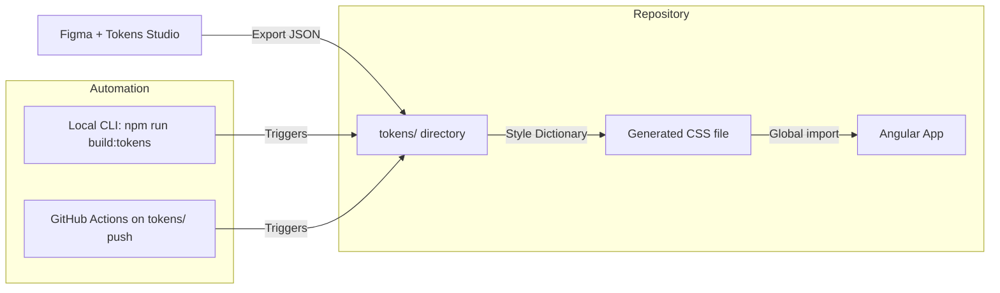
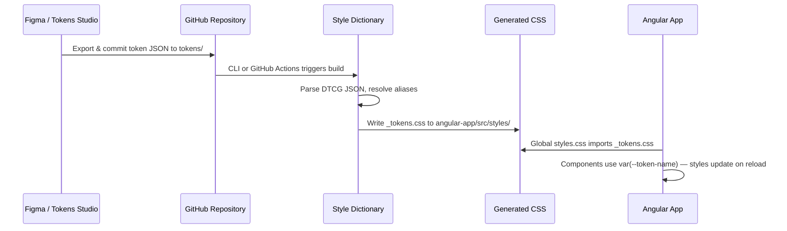

# Design Document: Tokenized Design System PoC

## Overview

This design describes a proof-of-concept tokenized design system that establishes a unidirectional data flow from Figma to a running Angular application. The architecture follows a pipeline pattern:

1. **Source**: Tokens Studio (Figma plugin) manages design tokens as structured data
2. **Export**: Tokens are exported as W3C DTCG-compatible JSON and committed to the repository
3. **Transform**: Style Dictionary reads the JSON and generates CSS custom properties
4. **Consume**: An Angular app references those CSS custom properties, so style changes require zero component code modifications

The system prioritizes simplicity and demonstrability over enterprise scale. It uses a monorepo structure with a root-level pipeline orchestrator and a nested Angular application.

## Architecture

### High-Level Flow



### Data Flow



### Sync Mechanisms

Two sync paths exist, both invoking the same Style Dictionary build:

1. **Local CLI** (`npm run build:tokens`): Developer runs after pulling updated token JSON. Immediate feedback loop for local development.
2. **GitHub Actions**: Triggers on pushes that modify `tokens/**`. Runs the pipeline and auto-commits the regenerated CSS, keeping the repo's generated CSS always in sync with the token source.

## Components and Interfaces

### 1. Tokens Studio (Figma Plugin) — External

- **Role**: Token authoring and management inside Figma
- **Output**: JSON file(s) in W3C DTCG format
- **Interface**: Manual export from Figma → file placed in `tokens/` directory
- **Token types managed**: colors, font sizes, font weights, spacing, border radii
- **Alias support**: Tokens can reference other tokens (e.g., `{color.blue.500}`)

### 2. Token JSON Source (`tokens/`)

- **Location**: `tokens/` at repository root
- **Format**: W3C DTCG-compatible JSON
- **Structure**:
  ```
  tokens/
  └── design-tokens.json
  ```
- **Schema**: Each token uses `$value` and `$type` fields. Tokens are grouped by category.

Example token file:
```json
{
  "color": {
    "primary": {
      "$value": "#3b82f6",
      "$type": "color"
    },
    "secondary": {
      "$value": "#10b981",
      "$type": "color"
    },
    "background": {
      "$value": "#ffffff",
      "$type": "color"
    },
    "text": {
      "$value": "#1f2937",
      "$type": "color"
    }
  },
  "spacing": {
    "xs": {
      "$value": "4px",
      "$type": "dimension"
    },
    "sm": {
      "$value": "8px",
      "$type": "dimension"
    },
    "md": {
      "$value": "16px",
      "$type": "dimension"
    },
    "lg": {
      "$value": "24px",
      "$type": "dimension"
    },
    "xl": {
      "$value": "32px",
      "$type": "dimension"
    }
  },
  "typography": {
    "heading": {
      "fontSize": {
        "$value": "24px",
        "$type": "dimension"
      },
      "fontWeight": {
        "$value": "700",
        "$type": "fontWeight"
      },
      "lineHeight": {
        "$value": "1.3",
        "$type": "number"
      }
    },
    "body": {
      "fontSize": {
        "$value": "16px",
        "$type": "dimension"
      },
      "fontWeight": {
        "$value": "400",
        "$type": "fontWeight"
      },
      "lineHeight": {
        "$value": "1.5",
        "$type": "number"
      }
    }
  },
  "borderRadius": {
    "sm": {
      "$value": "4px",
      "$type": "dimension"
    },
    "md": {
      "$value": "8px",
      "$type": "dimension"
    },
    "lg": {
      "$value": "16px",
      "$type": "dimension"
    }
  }
}
```

### 3. Style Dictionary Configuration

- **Location**: `style-dictionary.config.mjs` at repository root
- **Role**: Defines how DTCG tokens map to CSS custom properties
- **Key configuration**:
  - **Source**: `tokens/**/*.json`
  - **Platform**: `css`
  - **Transform group**: Custom transforms for DTCG `$value`/`$type` fields
  - **Output**: Single CSS file at `angular-app/src/styles/_tokens.css`
  - **Selector**: `:root`
  - **Naming**: Kebab-case with category prefix (e.g., `--color-primary`, `--spacing-md`, `--typography-heading-font-size`)

Style Dictionary v4+ has built-in DTCG format support via the `usesDtcg` option, which reads `$value` instead of `value`. The configuration leverages this:

```javascript
// style-dictionary.config.mjs
import StyleDictionary from 'style-dictionary';

const sd = new StyleDictionary({
  source: ['tokens/**/*.json'],
  usesDtcg: true,
  platforms: {
    css: {
      transformGroup: 'css',
      buildPath: 'angular-app/src/styles/',
      files: [
        {
          destination: '_tokens.css',
          format: 'css/variables',
          options: {
            selector: ':root',
            outputReferences: true
          }
        }
      ]
    }
  }
});

await sd.buildAllPlatforms();
```

### 4. Generated CSS Output

- **Location**: `angular-app/src/styles/_tokens.css`
- **Format**: Standard CSS with `:root` selector
- **Generated content example**:
  ```css
  :root {
    --color-primary: #3b82f6;
    --color-secondary: #10b981;
    --color-background: #ffffff;
    --color-text: #1f2937;
    --spacing-xs: 4px;
    --spacing-sm: 8px;
    --spacing-md: 16px;
    --spacing-lg: 24px;
    --spacing-xl: 32px;
    --typography-heading-font-size: 24px;
    --typography-heading-font-weight: 700;
    --typography-heading-line-height: 1.3;
    --typography-body-font-size: 16px;
    --typography-body-font-weight: 400;
    --typography-body-line-height: 1.5;
    --border-radius-sm: 4px;
    --border-radius-md: 8px;
    --border-radius-lg: 16px;
  }
  ```

### 5. Angular Application (`angular-app/`)

- **Framework**: Angular v19+ (latest stable), scaffolded via `ng new`
- **Structure**:
  ```
  angular-app/
  ├── src/
  │   ├── app/
  │   │   ├── app.component.ts       # Root component
  │   │   ├── app.component.html     # Demo page layout
  │   │   ├── app.component.css      # Component styles using var()
  │   │   ├── components/
  │   │   │   ├── demo-header/       # Header component
  │   │   │   ├── demo-button/       # Button component
  │   │   │   ├── demo-card/         # Card component
  │   │   │   └── demo-text/         # Text block component
  │   │   └── app.config.ts
  │   ├── styles/
  │   │   └── _tokens.css            # Generated by Style Dictionary
  │   ├── styles.css                 # Global styles, imports _tokens.css
  │   └── index.html
  ├── angular.json
  ├── package.json
  └── tsconfig.json
  ```

- **Global styles entry** (`styles.css`):
  ```css
  @import './styles/_tokens.css';

  body {
    font-family: system-ui, -apple-system, sans-serif;
    color: var(--color-text, #1f2937);
    background-color: var(--color-background, #ffffff);
    margin: 0;
    padding: 0;
  }
  ```

- **Component token consumption pattern**: Each demo component uses `var()` with fallbacks:
  ```css
  /* demo-button component */
  .demo-button {
    background-color: var(--color-primary, #3b82f6);
    color: var(--color-background, #ffffff);
    padding: var(--spacing-sm, 8px) var(--spacing-md, 16px);
    border-radius: var(--border-radius-md, 8px);
    font-size: var(--typography-body-font-size, 16px);
    font-weight: var(--typography-body-font-weight, 400);
    border: none;
    cursor: pointer;
  }
  ```

### 6. Sync Mechanism — Local CLI

- **Entry point**: `package.json` script at repository root
  ```json
  {
    "scripts": {
      "build:tokens": "node style-dictionary.config.mjs"
    }
  }
  ```
- **Behavior**: Reads `tokens/**/*.json`, runs Style Dictionary, writes `_tokens.css`
- **Error handling**: Style Dictionary exits with non-zero code on malformed JSON; the npm script propagates this

### 7. Sync Mechanism — GitHub Actions

- **Location**: `.github/workflows/build-tokens.yml`
- **Trigger**: Push events modifying `tokens/**`
- **Steps**:
  1. Checkout repository
  2. Setup Node.js
  3. Install dependencies (`npm ci`)
  4. Run `npm run build:tokens`
  5. Commit and push updated `_tokens.css` if changed
- **Error handling**: Pipeline failure fails the workflow; error appears in Actions log

```yaml
name: Build Design Tokens

on:
  push:
    paths:
      - 'tokens/**'

jobs:
  build-tokens:
    runs-on: ubuntu-latest
    steps:
      - uses: actions/checkout@v4

      - uses: actions/setup-node@v4
        with:
          node-version: '20'

      - run: npm ci

      - run: npm run build:tokens

      - name: Commit updated tokens CSS
        run: |
          git config user.name "github-actions[bot]"
          git config user.email "github-actions[bot]@users.noreply.github.com"
          git add angular-app/src/styles/_tokens.css
          git diff --cached --quiet || git commit -m "chore: regenerate token CSS"
          git push
```

### 8. Presentation Document (`PRESENTATION.md`)

- **Location**: Repository root
- **Sections**:
  1. **Stateful Consistency**: How the pipeline guarantees UI state matches token source — no manual sync, no drift
  2. **Maintainability**: Separation of design decisions from component code — change tokens, not components
  3. **Single Source of Truth**: Figma/Tokens Studio as the canonical authority — one place to update, everywhere reflects
  4. **Token Rehydration Flow**: Step-by-step walkthrough of the exact sequence from Figma change to Angular style update
  5. **Architecture Diagram**: Mermaid diagram showing the full pipeline


## Data Models

### Design Token (W3C DTCG Format)

Each token is a JSON object with `$value` and `$type` fields:

```typescript
interface DesignToken {
  $value: string | number;
  $type: 'color' | 'dimension' | 'fontWeight' | 'number';
}

interface TokenGroup {
  [key: string]: DesignToken | TokenGroup;
}

interface TokenFile {
  color?: TokenGroup;
  spacing?: TokenGroup;
  typography?: TokenGroup;
  borderRadius?: TokenGroup;
}
```

### Token Type Mapping

| DTCG `$type`  | CSS Output Format         | Example                          |
|----------------|---------------------------|----------------------------------|
| `color`        | Hex or RGB string         | `--color-primary: #3b82f6`       |
| `dimension`    | Value with unit           | `--spacing-md: 16px`             |
| `fontWeight`   | Numeric weight            | `--typography-heading-font-weight: 700` |
| `number`       | Unitless number           | `--typography-heading-line-height: 1.3` |

### CSS Custom Property Naming Convention

Tokens are flattened to kebab-case CSS custom property names following the JSON path:

```
{group}.{subgroup}.{name} → --{group}-{subgroup}-{name}
```

Examples:
- `color.primary` → `--color-primary`
- `spacing.md` → `--spacing-md`
- `typography.heading.fontSize` → `--typography-heading-font-size`
- `borderRadius.md` → `--border-radius-md`

### Generated CSS File Structure

```typescript
interface GeneratedCSSFile {
  selector: ':root';
  properties: Map<string, string>; // key: CSS custom property name, value: resolved value
}
```

The generated `_tokens.css` is a flat list of CSS custom properties under `:root`. It is the sole interface between the token pipeline and the Angular application — components never read token JSON directly.


## Correctness Properties

*A property is a characteristic or behavior that should hold true across all valid executions of a system — essentially, a formal statement about what the system should do. Properties serve as the bridge between human-readable specifications and machine-verifiable correctness guarantees.*

### Property 1: DTCG Format Compliance

*For any* token JSON file, every leaf token object SHALL contain both a `$value` field and a `$type` field, where `$type` is one of the recognized types (`color`, `dimension`, `fontWeight`, `number`).

**Validates: Requirements 1.5, 2.1**

### Property 2: Token Grouping Structure

*For any* valid token JSON file, every leaf token SHALL be reachable via a path that starts with a recognized group key (`color`, `spacing`, `typography`, `borderRadius`).

**Validates: Requirements 2.2**

### Property 3: Alias Resolution

*For any* token JSON file containing alias references (e.g., `{color.primary}`), the Token_Pipeline output CSS SHALL contain only resolved concrete values — no alias syntax SHALL appear in the generated CSS custom properties.

**Validates: Requirements 2.3**

### Property 4: Pipeline Produces Valid CSS Output

*For any* valid token JSON file, running the Token_Pipeline SHALL produce a single CSS file containing a `:root` selector with one CSS custom property for each leaf token in the input. The number of CSS custom properties in the output SHALL equal the number of leaf tokens in the input.

**Validates: Requirements 3.1, 3.2, 5.2**

### Property 5: Token Type Mapping Correctness

*For any* leaf token in a valid token JSON file, the Token_Pipeline SHALL produce a CSS custom property whose name follows the kebab-case path convention (e.g., `color.primary` → `--color-primary`) and whose value matches the resolved `$value` from the token.

**Validates: Requirements 3.3, 3.4, 3.5**

### Property 6: Invalid Input Rejection

*For any* malformed or invalid JSON input (missing `$value`, missing `$type`, invalid JSON syntax), the Token_Pipeline SHALL exit with a non-zero status code.

**Validates: Requirements 3.7**

### Property 7: Component CSS Token References with Fallbacks

*For any* `var()` reference in Angular component CSS files, the reference SHALL include both a CSS custom property name matching the `--{group}-{name}` convention and a fallback value as the second argument.

**Validates: Requirements 4.3, 4.6**

## Error Handling

### Token Pipeline Errors

| Error Condition | Behavior | Exit Code |
|----------------|----------|-----------|
| Malformed JSON in `tokens/` | Style Dictionary logs parse error, exits | Non-zero |
| Missing `$value` or `$type` on a token | Style Dictionary logs validation error, exits | Non-zero |
| Unresolvable alias reference | Style Dictionary logs unresolved reference, exits | Non-zero |
| Empty `tokens/` directory | Style Dictionary logs "no tokens found", exits | Non-zero |
| Output directory doesn't exist | Style Dictionary creates it (default behavior) | 0 |

### GitHub Actions Errors

| Error Condition | Behavior |
|----------------|----------|
| Pipeline fails | Workflow step fails, no commit made, error visible in Actions log |
| No changes to CSS after build | `git diff --cached --quiet` succeeds, no commit made, workflow succeeds |
| Git push fails | Workflow fails, error visible in Actions log |

### Angular App Errors

| Error Condition | Behavior |
|----------------|----------|
| `_tokens.css` missing | Components use fallback values from `var()` second argument |
| CSS custom property undefined | Browser uses fallback value specified in `var()` |
| Invalid CSS value in token | Browser ignores the property, falls back to inherited or default styles |

## Testing Strategy

### Dual Testing Approach

This PoC uses both unit tests and property-based tests for comprehensive coverage:

- **Unit tests**: Verify specific examples, edge cases, and file structure expectations
- **Property-based tests**: Verify universal properties across generated token inputs

### Property-Based Testing

**Library**: [fast-check](https://github.com/dubzzz/fast-check) (TypeScript/JavaScript property-based testing library)

**Configuration**:
- Minimum 100 iterations per property test
- Each test tagged with: **Feature: tokenized-design-system, Property {N}: {title}**
- Each correctness property implemented as a single property-based test

**Test scope**:
- Properties 1-2: Token JSON validation (generate random token structures, validate format)
- Property 3: Alias resolution (generate token files with aliases, verify CSS output has no alias syntax)
- Properties 4-5: Pipeline transformation (generate valid token JSON, run Style Dictionary, verify CSS output structure and values)
- Property 6: Invalid input rejection (generate malformed JSON, verify non-zero exit)
- Property 7: Static analysis of component CSS files (scan for var() usage patterns)

### Unit Tests

**Framework**: Jasmine (Angular default) for Angular component tests, Jest or Vitest for pipeline tests

**Test scope**:
- Verify specific demo components exist (header, button, card, text block)
- Verify `styles.css` imports `_tokens.css`
- Verify `package.json` contains `build:tokens` script
- Verify GitHub Actions workflow file exists and has correct trigger
- Verify specific token values produce expected CSS output (concrete examples)
- Verify repository structure (directories, config files)

### Test Organization

```
tests/
├── token-validation.property.test.ts    # Properties 1, 2
├── pipeline-transform.property.test.ts  # Properties 3, 4, 5
├── pipeline-errors.property.test.ts     # Property 6
├── component-css.property.test.ts       # Property 7
└── structure.unit.test.ts               # Unit tests for repo structure, file existence
```
