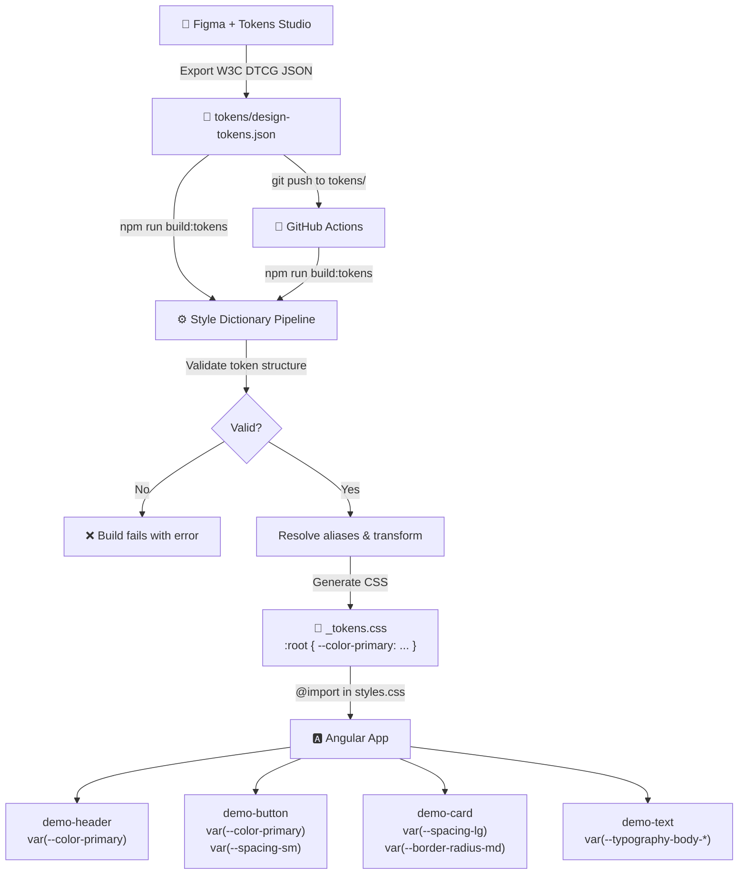

# Tokenized Design System — Presentation Outline

## 1. Stateful Consistency

The token pipeline guarantees that the Angular UI always reflects the current token values — no manual sync, no drift.

- Every visual property (color, spacing, typography, border radius) is driven by a single token JSON file
- The pipeline is deterministic: the same input tokens always produce the same CSS output
- Components never hardcode design values — they reference CSS custom properties via `var()`
- If the generated CSS is missing, components gracefully degrade to fallback values
- There is no intermediate manual step where state can diverge: token JSON → pipeline → CSS → UI

**Key takeaway**: The UI state is a pure function of the token source. Change the tokens, rebuild, and the UI updates. Nothing else to touch.

## 2. Maintainability

Separating design decisions from component code reduces maintenance burden and prevents style fragmentation.

- Design values live in `tokens/design-tokens.json`, not scattered across component CSS files
- Changing a color, spacing value, or font size is a single edit in one JSON file — not a find-and-replace across dozens of components
- Components are stable: their CSS references token names (`--color-primary`), not concrete values (`#1d2038`)
- Adding a new component that follows the design system means referencing existing tokens, not copying hex codes
- The pipeline validates token structure before generating CSS — malformed tokens fail fast with clear error messages

**Key takeaway**: Design decisions are centralized. Component code is decoupled from specific values. Maintenance scales linearly, not exponentially.

## 3. Single Source of Truth

Tokens Studio in Figma serves as the canonical source for all design values, eliminating duplication across design and code.

- Designers define tokens in Figma using Tokens Studio — this is the authoritative source
- The exported JSON is a direct serialization of those design decisions
- Style Dictionary transforms (not reinterprets) the tokens into CSS
- There is exactly one path from design intent to rendered UI:

  **Figma → JSON → CSS → Browser**

- No developer manually translates a Figma spec into CSS values
- No designer maintains a separate style guide that drifts from the codebase
- When a designer updates a token in Figma, the same value flows through to the Angular app

**Key takeaway**: One place to update, everywhere reflects. The design file and the running app are always in agreement.


## 4. Token Rehydration Flow

The exact sequence of steps from a Figma token change to an Angular style update:

1. **Designer updates token** — In Figma, the designer opens Tokens Studio and changes a value (e.g., `color.primary` from `#1d2038` to `#7c3aed`)

2. **Export JSON** — Tokens Studio exports the full token set as a W3C DTCG-compatible JSON file with `$value` and `$type` fields

3. **Commit to repository** — The exported `design-tokens.json` is placed in the `tokens/` directory and committed to Git

4. **Pipeline triggers** — Either:
   - **Locally**: Developer runs `npm run build:tokens`
   - **CI**: GitHub Actions detects the push to `tokens/` and runs the pipeline automatically

5. **Validation** — The pipeline validates every token has `$value` and `$type` fields. Malformed tokens halt the build with a descriptive error.

6. **Transformation** — Style Dictionary reads the DTCG JSON, resolves any alias references, and generates CSS custom properties under a `:root` selector

7. **CSS output** — The generated `_tokens.css` file is written to `angular-app/src/styles/`, containing entries like:
   ```css
   :root {
     --color-primary: #7c3aed;
     /* ... all other tokens ... */
   }
   ```

8. **Angular consumption** — The Angular app's global `styles.css` imports `_tokens.css`. Components reference tokens via `var(--color-primary, #1d2038)` with fallbacks.

9. **UI update** — On page reload (or hot-reload during development), the browser picks up the new CSS custom property values. The header, button, card, and text components all reflect the updated design tokens.

## 5. Architecture Diagram



## Talking Points

- **"Why not just use SCSS variables?"** — CSS custom properties are live in the browser. They can be changed at runtime, inspected in DevTools, and don't require a build step in the Angular app. SCSS variables are compiled away.

- **"What if the tokens file is missing?"** — Every `var()` reference includes a fallback value. The app renders with sensible defaults even without the generated CSS.

- **"How does this scale?"** — The same pipeline works whether you have 20 tokens or 2,000. Style Dictionary handles large token sets efficiently. Adding new token categories means adding groups to the JSON and referencing new CSS custom properties in components.

- **"What about dark mode / theming?"** — This PoC uses a single token set under `:root`. For theming, you'd add multiple token sets (e.g., `light.json`, `dark.json`) and generate scoped CSS (e.g., `[data-theme="dark"]`). The component code stays identical.
